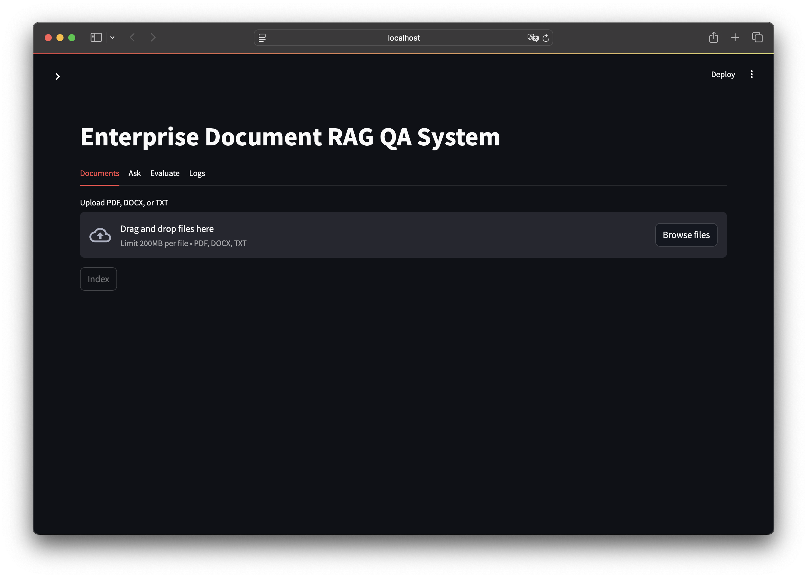
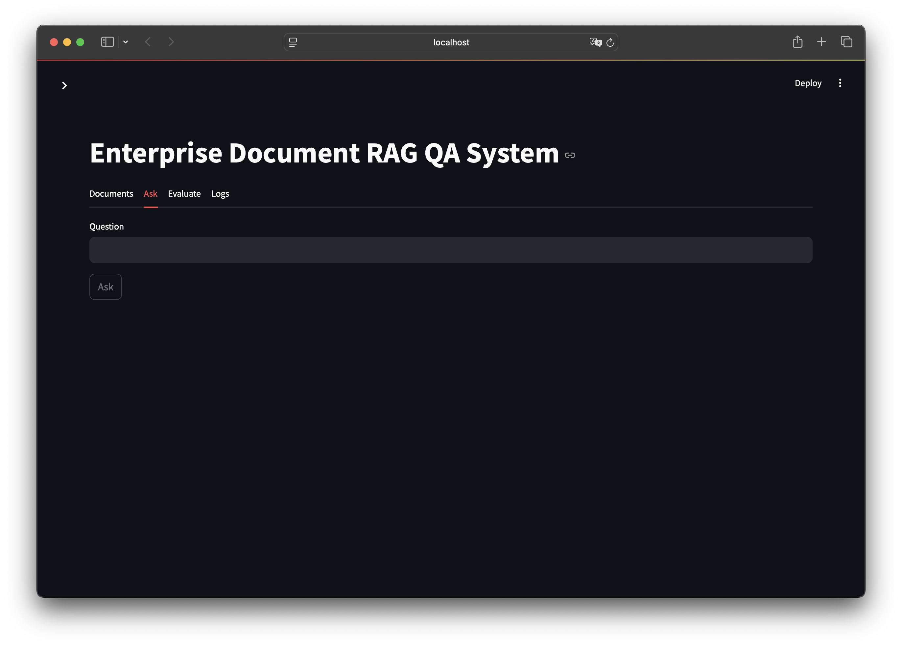
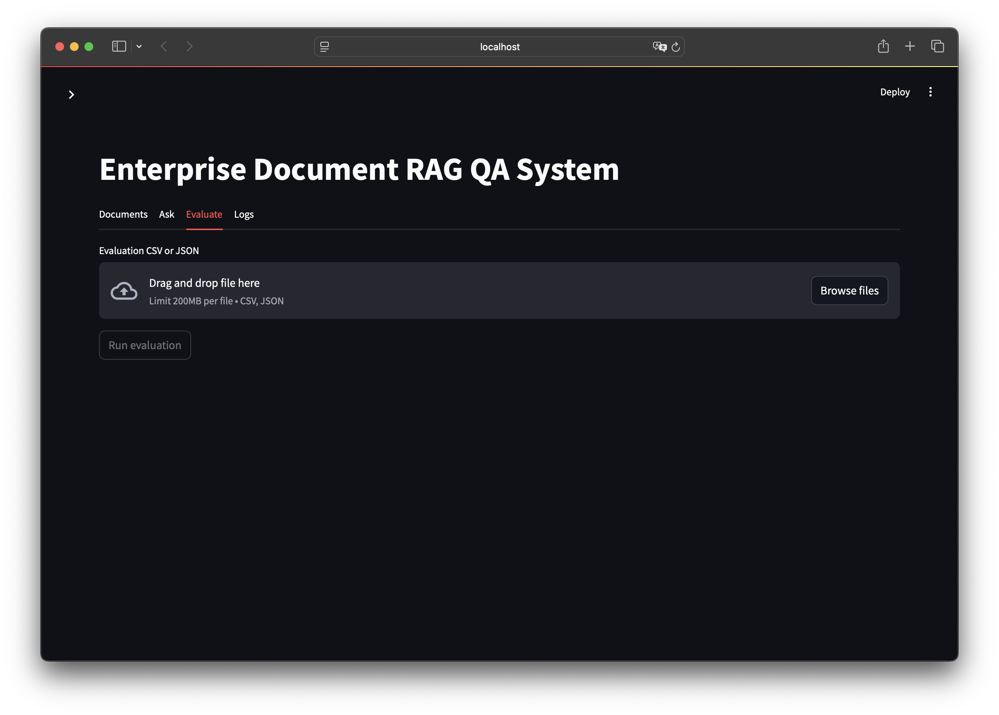

# Enterprise Document RAG QA System

Source-grounded RAG question answering for synthetic enterprise banking documents, with hybrid retrieval, no-answer handling, evaluation, and query logging.

**Python 3.11+ | Streamlit | RAG | Hybrid Retrieval | Evaluation | SQLite Logging**

The project runs without an OpenAI API key using a deterministic `MockProvider`, and it can switch to OpenAI when `OPENAI_API_KEY` is configured.

## Why This Project Matters

Organizations store policy, compliance, operations, risk, product, and support knowledge across many document formats. A useful enterprise QA system must answer from evidence, show sources, and refuse unsupported questions instead of guessing. This project models that workflow in a local, reproducible portfolio prototype.

## More Than A Basic PDF Chatbot

This is not a single-file prompt wrapper. The implementation separates ingestion, chunking, indexing, retrieval, answer generation, evaluation, logging, and UI orchestration. It includes:

- Metadata-preserving document chunks.
- Hybrid retrieval using semantic embeddings and BM25 keyword scoring.
- Explicit no-answer handling when evidence is insufficient.
- Source citations for every answered response.
- SQLite query logging for auditability.
- A 46-question benchmark with retrieval, citation, and no-answer metrics.
- Tests that run without external model downloads or API keys.

## Quick Start

```bash
python -m venv .venv
source .venv/bin/activate
pip install -r requirements.txt
python -m pytest -q
python -m src.evaluation.run_eval
python -m streamlit run app/streamlit_app.py
```

Mock mode note: the project runs without an OpenAI API key using `MockProvider`. This keeps tests, evaluation, and demos reproducible on a clean machine.

## Demo Screenshots

This is a portfolio prototype using synthetic sample documents. When no OpenAI API key is configured, the app runs with `MockProvider` for reproducible local demos.

**Upload and indexing interface**



**Question answering with source-grounded retrieval**



**Evaluation dashboard with retrieval metrics**



## Key Features

- Upload and parse PDF, DOCX, and TXT documents.
- Preserve `file_name`, `document_id`, `page_number`, `chunk_id`, and character offsets.
- Clean and chunk document text with overlap.
- Build a local in-memory vector index.
- Optionally persist semantic vectors and chunk metadata locally with Chroma.
- Use sentence-transformers as the production semantic retrieval path.
- Use a deterministic hashing embedder in tests and fallback environments.
- Score keyword evidence with a local BM25 implementation.
- Merge semantic and keyword scores into hybrid retrieval results.
- Generate answers through OpenAI or MockProvider.
- Return: `I could not find enough evidence in the uploaded documents.` when evidence is weak.
- Save query logs to SQLite.
- Run evaluation and generate CSV plus Markdown reports.
- Provide a Streamlit UI for upload, asking, evaluation, and logs.

## System Architecture

```text
Documents
-> Parser
-> Cleaner
-> Chunker
-> Embedding Index (memory or Chroma) + BM25 Index
-> Hybrid Retriever
-> Evidence Gate / No-answer Check
-> LLM Provider
-> Source-grounded Answer
-> Logs + Evaluation
```

Core application logic lives under `src/`. The Streamlit app in `app/streamlit_app.py` orchestrates these modules but does not implement retrieval or QA logic directly.

## Folder Structure

```text
enterprise-document-rag/
├── app/
│   └── streamlit_app.py
├── configs/
│   └── config.yaml
├── data/
│   ├── sample_docs/
│   ├── raw_docs/
│   ├── processed/
│   ├── eval/
│   ├── logs/
│   └── vector_store/
├── src/
│   ├── ingestion/
│   ├── indexing/
│   ├── retrieval/
│   ├── llm/
│   ├── qa/
│   ├── evaluation/
│   └── utils/
├── tests/
├── outputs/
│   ├── eval_results.csv
│   ├── evaluation_report.md
│   └── demo_transcript.md
├── README.md
├── PORTFOLIO_SUMMARY.md
├── requirements.txt
├── .env.example
├── .gitignore
└── Makefile
```

## Setup

Python 3.11+ is recommended.

```bash
make install
cp .env.example .env
```

The explicit command checklist is shown in Quick Start above. `make install` is a convenience wrapper around creating `.venv` and installing `requirements.txt`.

Run tests:

```bash
python -m pytest -q
```

Or, if you use the project virtual environment:

```bash
.venv/bin/python -m pytest -q
```

## Run In Mock Mode

Mock mode requires no API key and no external LLM call.

```bash
unset OPENAI_API_KEY
python -m streamlit run app/streamlit_app.py
```

If `sentence-transformers` is not installed or the configured model cannot load, the app falls back to the deterministic hashing embedder so the demo can still run locally. Tests always inject a local test embedder to avoid model downloads.

## Run With OpenAI API

Set your key in the environment or in a local `.env` file that you load before starting the app. Do not commit real keys.

```bash
export OPENAI_API_KEY="your-key-here"
python -m streamlit run app/streamlit_app.py
```

With `qa.provider: auto` in `configs/config.yaml`, the system uses OpenAI when the key is present and MockProvider otherwise. If you want to force OpenAI mode, set `qa.provider: openai` in `configs/config.yaml`; startup will then require `OPENAI_API_KEY`. Do not put any real API key in the repository.

## Persistent Vector Store With Chroma

The default vector store backend is `memory`, which preserves the original behavior: uploaded documents are indexed in the running app process and are lost after restart.

To persist indexed chunks and embeddings locally, install requirements and set the retrieval backend to Chroma:

```yaml
retrieval:
  vector_store: chroma
  persist_directory: data/vector_store
  collection_name: enterprise_document_chunks
```

Then launch the app:

```bash
python -m streamlit run app/streamlit_app.py --server.fileWatcherType none
```

Chroma stores chunk text, embeddings, and citation metadata under `data/vector_store/`. That directory is gitignored because it is generated local state and can grow quickly. In Chroma mode, the app sidebar shows the active backend, persist directory, collection name, and stored chunk count. It also provides a confirmed clear button for the persistent vector store.

The app loads stored Chroma chunks on startup and rebuilds BM25 from the saved chunk text, so hybrid retrieval can work after restart without re-uploading documents. Chroma persistence here is local and intended for portfolio/demo use; multi-user or cloud deployments would need a managed vector database or server-backed Chroma setup.

Environment overrides are also supported:

```bash
export VECTOR_STORE=chroma
export CHROMA_PERSIST_DIRECTORY=data/vector_store
export CHROMA_COLLECTION_NAME=enterprise_document_chunks
```

## Run Evaluation

The evaluation CLI uses the synthetic benchmark in `data/sample_docs/` and `data/eval/qa_eval_set.csv`. It uses MockProvider and hashing embeddings so it runs without an OpenAI key or model download.

```bash
python -m src.evaluation.run_eval
```

Outputs:

- `outputs/eval_results.csv`
- `outputs/evaluation_report.md`
- `outputs/demo_transcript.md` contains a short mock-mode transcript for quick review.

The CSV includes question ID, question type, difficulty, answerability, expected document/page, expected keywords, retrieved chunk IDs, retrieved documents, top score, Hit@3, Hit@5, reciprocal rank, no-answer flag, citation flag, latency, answer preview, and failure reason.

## Evaluation Benchmark

The benchmark uses six synthetic banking and enterprise operations documents. These files are demo documents created for evaluation and contain no confidential, proprietary, or customer data.

Documents:

- `bank_recruitment_policy.txt`
- `retail_banking_product_guide.txt`
- `credit_risk_policy_summary.txt`
- `data_security_policy.txt`
- `branch_operations_manual.txt`
- `customer_marketing_campaign_guide.txt`

The benchmark contains 46 questions across fact lookup, policy lookup, product lookup, numeric thresholds, role responsibilities, cross-document questions, and no-answer cases.

Question distribution:

| Question type | Count |
| --- | ---: |
| fact_lookup | 4 |
| policy_lookup | 6 |
| product_lookup | 4 |
| numeric_threshold | 14 |
| role_responsibility | 7 |
| cross_document | 6 |
| no_answer | 5 |

Current local benchmark metrics from `python -m src.evaluation.run_eval`:

| Metric | Value |
| --- | ---: |
| Questions | 46 |
| Answerable questions | 41 |
| Unanswerable questions | 5 |
| Hit@3 | 1.0000 |
| Hit@5 | 1.0000 |
| MRR | 0.9878 |
| No-answer accuracy | 1.0000 |
| Citation rate | 1.0000 |
| Average latency (ms) | ~0.70 |

The report also lists weak examples. In the current baseline, several failures are answer-quality issues where retrieval found the right document but the deterministic MockProvider answer did not include every expected keyword. This is intentional: the project is not only a RAG demo; it includes retrieval evaluation, no-answer testing, and failure analysis.

## Example Questions

After indexing the included synthetic sample documents or your own enterprise documents, try:

- What cap applies to employee referral bonuses?
- What direct deposit amount waives the Everyday Checking monthly fee?
- Who approves customer-facing claims before a campaign launches?
- Compare the direct deposit amount that waives checking fees with the bonus campaign deposit total.
- What is the bank's cryptocurrency custody product code?

The last question is intentionally unsupported and should return the no-answer message.

## Evaluation Design

The evaluation pipeline measures:

- `Hit@3`: whether a relevant chunk or document appears in the top 3 retrieved results.
- `Hit@5`: whether a relevant chunk or document appears in the top 5 retrieved results.
- `MRR`: reciprocal rank of the first relevant retrieval result.
- `No-answer accuracy`: whether unanswerable examples return the no-answer response.
- `Average latency`: average pipeline latency in milliseconds.

Evaluation matters because a RAG system should be judged on retrieval quality and refusal behavior, not only on whether a demo can produce fluent answers. This project evaluates whether expected documents are retrieved, whether unsupported questions are refused, whether citations are present, and where answer quality is weak.

## Current Limitations

- The default local vector index is in memory and intended for small to medium demo datasets.
- Chroma persistence is local, not a managed production vector database.
- The sample documents are synthetic and contain no confidential data.
- DOCX page numbers are approximated as page `1` because DOCX files do not store stable rendered page boundaries.
- TXT files expose only page `1`, so page-level evaluation is limited for the current benchmark.
- MockProvider is deterministic and useful for testing, but it does not represent final LLM answer quality.
- Evaluation uses local hashing embeddings if sentence-transformers is unavailable.
- The benchmark is synthetic and much smaller than a real enterprise knowledge base.
- This is a portfolio prototype, not a production enterprise system.
- No CrossEncoder reranker, Docker setup, or external vector database is included in this first stable version.

## Future Improvements

- Add a real PDF benchmark with stable page-level citations.
- Add OCR support for scanned documents.
- Add a managed or server-backed vector database option for deployment.
- Add an optional reranker after the base retriever is stable.
- Add an Ollama local model backend for offline answer generation.
- Add real OpenAI answer quality evaluation with human-reviewed examples.
- Add deployment packaging for a hosted demo.
- Add document-level metadata filters such as department, date, or access tier.
- Add batch ingestion and incremental re-indexing.
- Add authentication and role-aware retrieval for a more enterprise-like demo.

## Suggested Resume Bullet Points

- Built an enterprise-style document RAG QA system with PDF, DOCX, and TXT ingestion, metadata-preserving chunking, hybrid semantic/BM25 retrieval, source-grounded answer generation, and SQLite query logging.
- Implemented no-answer handling and citation validation to reduce unsupported answers in document question answering workflows.
- Developed an evaluation pipeline measuring Hit@3, Hit@5, MRR, no-answer accuracy, and latency, with reproducible CSV and Markdown reports.
- Created a Streamlit demo that separates UI orchestration from backend retrieval and QA modules, supporting both OpenAI and deterministic mock execution.
